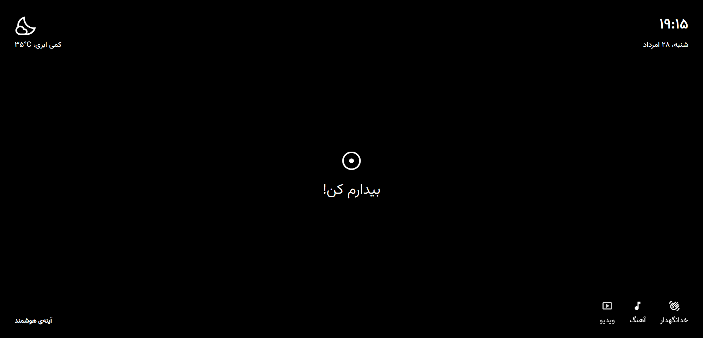

# RoboDoc Lab's Smart Mirror

This repository contains the prototype for the Smart Mirror project at RoboDoc
Lab, IRANDOC.

This app is made with [Dawn](https://github.com/Hawmex/dawn) (succeeded by
[Navand](https://github.com/Hawmex/navand)).

## Features

- Voice activation
- An interaction scenario upon activation
- A weather widget
- A DateTime widget
- Voice commands
  - A voice command for playing videos
  - A voice command for playing music
  - A voice command for deactivating the mirror

## Getting Started

### Serve the Application

First, you should install `webdev`:

```
dart pub global activate webdev
```

Then, you can serve the app by running:

```
webdev serve
```

### Build the Application

To build the application, run:

```
webdev build
```

You can find the output at `build/`.

## Screenshots

### Inactive State

- The DateTime widget is on the top right.
- The weather widget is on the top left.
- "Wake me up!" is shown in the center.
- The available voice commands are shown on the bottom right.
- The Smart Mirror's name is on the bottom left.


